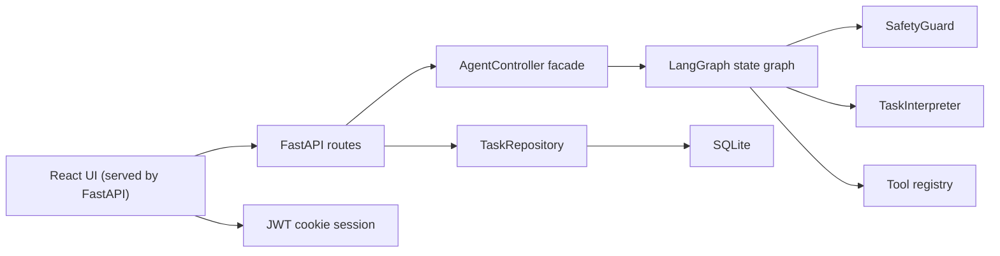
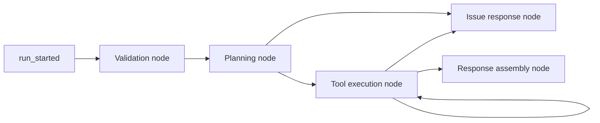
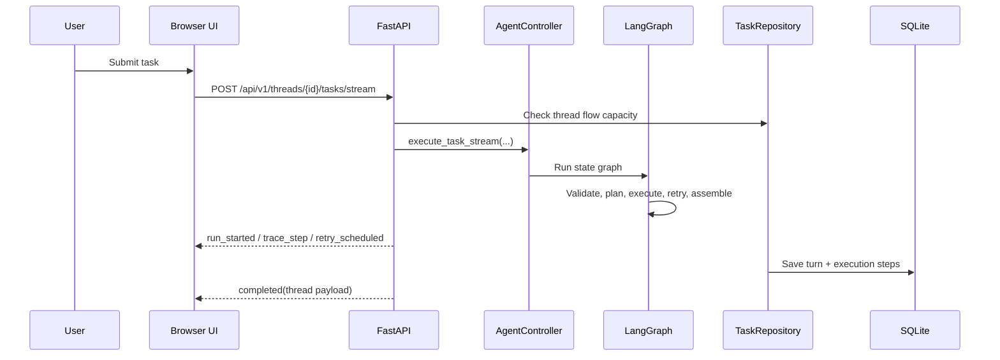
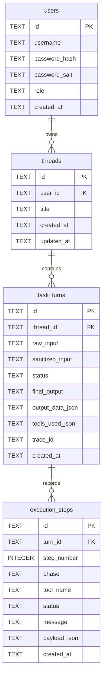

# TaskBuddy

TaskBuddy is a lightweight full-stack coding-challenge submission built around a FastAPI backend, a React frontend served as static assets by FastAPI, deterministic tool routing, SQLite persistence, and a LangGraph-backed orchestration flow.

The application lets a signed-in user create chat threads, submit task requests, inspect structured execution traces, and review saved task history. The admin page supports local user creation and deletion with lightweight RBAC.

## How To Run

### Local: one command

FastAPI serves the built frontend, so there is no separate frontend runtime process for local use.

Windows PowerShell:

```powershell
powershell -ExecutionPolicy Bypass -File .\scripts\run-taskbuddy.ps1
```

Linux, macOS, WSL, or Git Bash:

```bash
./scripts/run-taskbuddy.sh
```

What the scripts do:
- detect a usable Python interpreter, preferring Python 3.12
- create `.venv` if it does not exist
- install `requirements.txt` when first run or when requirements change
- activate the virtual environment
- start FastAPI with `python app.py`

Open `http://localhost:8000`.

### Local: manual fallback

```powershell
python -m venv .venv
.venv\Scripts\Activate.ps1
python -m pip install -r requirements.txt
python app.py
```

Open `http://localhost:8000`.

### Docker

```powershell
docker build -t taskbuddy .
docker run --rm -p 8000:8000 taskbuddy
```

### Docker Compose

```powershell
docker compose up --build
```

The Compose setup mounts a named volume for `backend/data`, so local SQLite data survives container restarts.

## Dependencies

### Runtime

| Dependency | Version |
| --- | --- |
| Python | `3.12.1` |
| FastAPI | `0.115.12` |
| LangGraph | `1.1.2` |
| SQLite | bundled with Python |

### Development, Test, and Build

| Dependency | Version |
| --- | --- |
| Node.js | `v20.20.1` |
| npm | `10.8.2` |
| React | `19.2.4` |
| Vite | `8.0.0` |
| Vitest | `3.2.4` |
| Pytest | `8.3.5` |

## TaskBuddy Details

### Core capabilities

- chat-style thread history with persisted task turns
- deterministic tool routing with execution trace visibility
- structured output, tool list, timestamp, and final result for each turn
- FastAPI sync and streaming task execution endpoints
- dedicated admin page for local user management
- local SQLite persistence for users, threads, turns, and execution steps

### Supported tools

| Tool name | Description | Supported functionality | Supported prompt patterns / synonyms | Example usage | Limitations / unsupported phrasing |
| --- | --- | --- | --- | --- | --- |
| `TextProcessorTool` | Deterministic text formatting and counting helper. | Uppercase, lowercase, titlecase, word count, character count. | `convert ... to uppercase`, `make ... lowercase`, `title case`, `word count`, `count words`, `count the word`, `count word`, `count the words in`, `how many words are in`, `character count`, `count characters`. | `Count the word "test"` -> `1` | Counts words in the provided text only. It does not count occurrences or substrings inside a larger body of text. |
| `CalculatorTool` | Safe arithmetic evaluator without `eval`. | Arithmetic with `+`, `-`, `*`, `/`, parentheses, unary plus/minus. | `calculate`, `what is`, `solve`, `compute`, `add`, `sum`, `subtract`, `difference between`, `multiply`, `product of`, `divide`, `quotient of`, `plus`, `minus`, `times`, `multiplied by`, `divided by`, `over`. | `What is 8 minus 3?` | Basic arithmetic only. Exponentiation, variables, functions, and non-arithmetic syntax are unsupported. |
| `WeatherMockTool` | Returns deterministic mock weather payloads. | Condition, temperature, and humidity for configured cities. | `weather`, `forecast`, `temperature`, `condition`, `humidity` plus a supported city name. | `Forecast for London` | Supported cities only: Toronto, Vancouver, New York, Chicago, London, Sydney. No live external weather API is used. |
| `CurrencyConverterTool` | Converts between fixed mock exchange rates. | Positive numeric conversion between `USD`, `CAD`, `GBP`, and `AUD`. | `convert`, `exchange`, `currency`, `rate`, or prompts containing a supported amount/currency pair. | `Exchange 15 USD to CAD` | Only `USD`, `CAD`, `GBP`, and `AUD` are supported. Rates are static mock rates, not live market data. |
| `TransactionCategorizerTool` | Keyword-based spending category classifier. | Categorizes merchants/descriptions into groceries, transport, bills, dining, shopping, travel, entertainment, or `other`. | `categorize`, `category`, `transaction`, `merchant`, `classify`, `classification`, `spend`, `spending`. | `Classify Starbucks spend` | Matching is keyword-based rather than ML-based, so unmatched descriptions fall back to `other`. |

### Current product limits

- maximum `5` threads per user
- maximum `3` saved task flows per thread
- maximum `2` subtasks inside a single request
- maximum `1` admin account
- maximum `2` standard user accounts

## Architecture



### LangGraph orchestration



### Request sequence



## Database Schema



## Routes And Navigation

### Browser routes

- `/` workspace home
- `/threads/:threadId` selected chat thread
- `/admin` admin-only user management

### API routes

- `POST /api/v1/auth/login`
- `POST /api/v1/auth/logout`
- `GET /api/v1/auth/me`
- `GET /api/v1/threads`
- `POST /api/v1/threads`
- `GET /api/v1/threads/{thread_id}`
- `DELETE /api/v1/threads/{thread_id}`
- `POST /api/v1/threads/{thread_id}/tasks`
- `POST /api/v1/threads/{thread_id}/tasks/stream`
- `GET /api/v1/admin/users`
- `POST /api/v1/admin/users`
- `DELETE /api/v1/admin/users/{user_id}`
- `GET /health`

### API authentication matrix

| Route group | Access | Endpoints |
| --- | --- | --- |
| Auth bootstrap | Public | `POST /api/v1/auth/login`, `POST /api/v1/auth/logout` |
| Health and static UI | Public | `GET /health`, frontend asset routes, browser routes served by FastAPI |
| Session and thread APIs | Authenticated | `GET /api/v1/auth/me`, all `/api/v1/threads*` endpoints |
| Admin APIs | Admin only | `GET /api/v1/admin/users`, `POST /api/v1/admin/users`, `DELETE /api/v1/admin/users/{user_id}` |

## Default Access And Admin Behavior

Fresh initialization seeds only the bootstrap admin account:

| Username | Password | Role |
| --- | --- | --- |
| `admin` | `admin123` | `admin` |

Admin password visibility behavior:
- passwords stay one-way hashed in the database
- existing users do not expose stored passwords through the API
- the admin UI can only reveal passwords for users created in the current admin session

## Assumptions And Tradeoffs

- FastAPI is the single local runtime entrypoint; the built frontend is served from `backend/static`.
- Tool routing is deterministic rather than LLM-based so execution paths stay explainable and testable.
- LangGraph is used as an orchestration wrapper around deterministic nodes, not as a model-driven planner.
- Weather and currency responses are mock data to keep the challenge self-contained.
- JWT cookie auth is intentionally lightweight and challenge-scoped.
- SQLite is sufficient for local persistence and reviewer setup simplicity.
- Password visibility is intentionally session-only to avoid storing recoverable credentials.
- The route model uses browser history APIs directly instead of adding a client-side routing library.

## Limitations

- only one bootstrap admin account is seeded automatically
- only two standard user accounts can exist at one time
- only five chat threads can exist per user
- only three saved task flows can exist inside one thread
- only two subtasks can be handled in a single request
- no external live APIs are used for weather or exchange rates
- password reveal does not survive refresh because it is intentionally not persisted
- local runtime assumes the committed frontend build is present

## Tests And Reports

### Backend

```powershell
.venv\Scripts\python.exe -m pytest --junitxml reports/backend-junit.xml
```

### Frontend

```powershell
cd frontend
npm test
cd ..
```

### Reviewer export

```powershell
.venv\Scripts\python.exe scripts/export_test_results.py
```

Generated artifacts:
- `reports/backend-junit.xml`
- `reports/frontend-junit.xml`
- `reports/test-results.xlsx`
- `reports/test-dashboard.html`

The exporter normalizes coverage labels so `Bonus:` does not appear in the coverage outputs.

## Time Spent

| Task | Subtask | Hours |
| --- | --- | ---: |
| Challenge review and design | Read prompt, define architecture, decide persistence and UX approach | 1.5 |
| Backend implementation | Auth, repository, limits, LangGraph orchestration, tool routing | 2.5 |
| Frontend implementation | Workspace flow, routing, admin UX, password reveal behavior | 2.5 |
| Testing and reporting | Backend tests, frontend tests, JUnit export, dashboard export | 1.0 |
| Documentation and polish | README, technical design, diagrams, Docker/Compose/runtime scripts | 1.5 |
| Total |  | 9.0 |

## Improvements With More Time

- add optimistic loading and explicit loading states for direct thread-route fetches
- add update-user flows instead of create/delete only
- add stronger audit logging around admin actions
- move the large `App.tsx` file into smaller route and feature modules
- add richer semantic matching for tools beyond deterministic keyword expansion
- add end-to-end browser tests for route transitions and streaming behavior
- add health checks and container-level readiness configuration for Compose

## Additional Documentation

- [Technical design](docs/technical-design.md)
