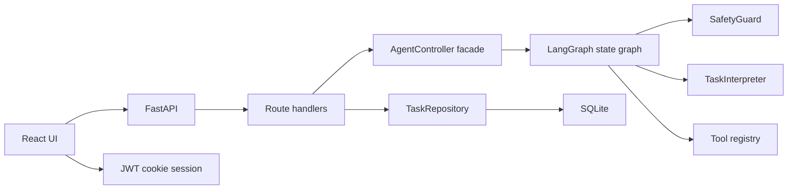
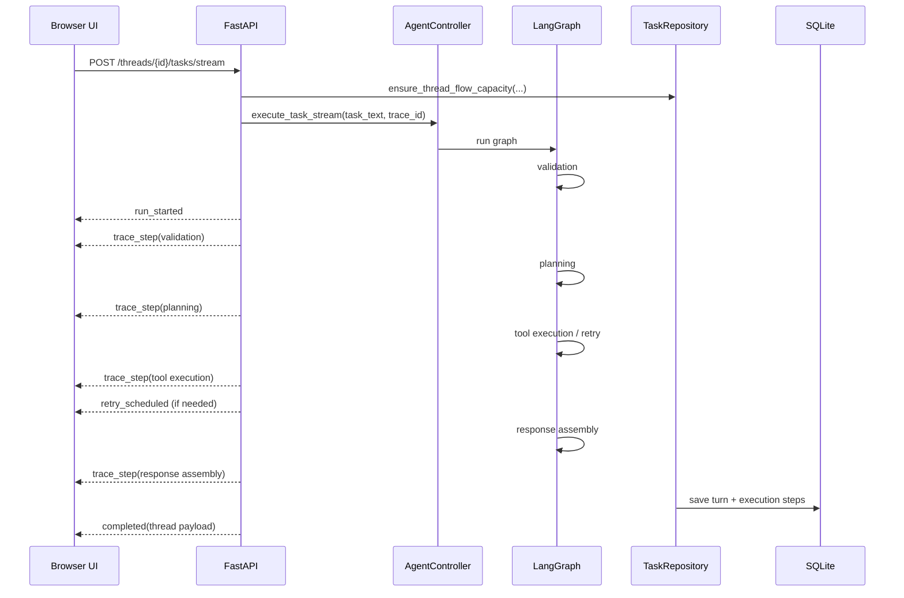
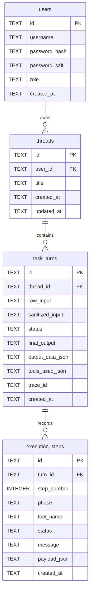

# TaskBuddy Technical Design

## Overview

TaskBuddy is a deterministic task workspace with four durable concepts:

- one authenticated local user session
- many chat threads per user, capped at `5`
- many saved task flows per thread, capped at `3`
- many ordered execution steps per saved turn

The backend remains FastAPI-first, but orchestration now runs through a LangGraph state graph that wraps the existing validation, planning, tool execution, retry, and response-assembly stages.

## Runtime Model

- local runtime is a single FastAPI process started with `python app.py`
- the built React frontend is served from `backend/static`
- there is no separate frontend runtime process for reviewer usage
- helper scripts create `.venv`, install dependencies, activate the environment, and start the backend

## System Architecture

### Ownership

- React owns browser UI state, history navigation, and streamed pending-turn rendering.
- FastAPI owns auth, routing, error normalization, and static asset serving.
- `AgentController` owns the stable API-facing execution contract.
- LangGraph owns internal state transitions for validation, planning, tool execution, retry scheduling, and response assembly.
- `TaskRepository` owns SQLite initialization, seeding, persistence, and limit enforcement.

## Routing Design

### Browser routes

- `/` home workspace without auto-selecting a thread
- `/threads/:threadId` selected chat
- `/admin` admin-only management page

### Route behavior

- Selecting or creating a chat pushes `/threads/:threadId`.
- Direct navigation to a valid thread URL loads that thread after authentication.
- Direct navigation to a missing thread redirects back to `/` and shows a banner.
- Deleting the current thread routes to the next available thread or back to `/`.

## LangGraph Orchestration

### Graph nodes

- `validation`
- `planning`
- `execute_tool`
- `issue_response`
- `response_assembly`

### State carried through the graph

- raw task text
- sanitized task text
- parsed execution plan
- current tool index
- retry counter
- prior tool summary context
- collected tool results
- trace steps
- final output payload
- handled issue state
- completed `TurnExecution`

### Why LangGraph here

- it makes orchestration stages explicit without changing the deterministic product behavior
- it preserves the existing REST and SSE response contracts
- it keeps multi-step routing extensible if more tools are added later

### Why not an LLM planner

- the challenge only requires tool selection and execution transparency
- deterministic routing is easier to test and explain
- the shipped tools are narrow enough that heuristic routing is sufficient

## Request Lifecycle

### Sync vs streaming

- `POST /tasks` runs the same LangGraph-backed controller flow and returns the final turn.
- `POST /tasks/stream` wraps that flow in SSE events:
- `run_started`
- `trace_step`
- `retry_scheduled`
- `completed`
- `failed`

## Persistence Design

### Persistence notes

- thread titles are auto-generated from the first saved task
- masked numeric content is persisted when sensitive patterns are detected
- admin seeding creates only the bootstrap admin account on fresh initialization
- `TaskRepository` rejects:
- a 6th thread for the same user
- a 4th saved turn inside the same thread
- user creation beyond configured role capacity

## Tool Routing

### Current tool families

- text transformation and counting
- arithmetic
- mock weather
- mock currency conversion
- transaction categorization

### Matching strategy

- direct text-operation phrases
- arithmetic symbols and calculator synonyms such as `add`, `plus`, `minus`, `times`, and `divided by`
- weather synonyms such as `forecast`, `temperature`, `condition`, and `humidity`
- finance and classification synonyms for currency conversion and transaction categorization
- guarded multi-subtask splitting so phrases like `add 3 and 2` are treated as one calculator request instead of two subtasks

## Admin And Security

- roles are `admin` and `user`
- startup seeds only the bootstrap admin account
- password storage is PBKDF2 + salt and remains one-way hashed
- the admin page never receives persisted passwords from the backend
- password reveal is session-only on the frontend for newly created users

## Limits And Validation

- max request length: `250` characters
- max subtasks per request: `2`
- max threads per user: `5`
- max saved task flows per thread: `3`
- max admin accounts: `1`
- max standard user accounts: `2`

## Runtime And Containerization

### Local scripts

- `scripts/run-taskbuddy.ps1`
- `scripts/run-taskbuddy.sh`

Both scripts:
- detect Python
- create `.venv`
- install `requirements.txt` only when needed
- activate the environment
- start `python app.py`

### Containers

- Docker builds the frontend assets in a Node stage and serves them from the Python runtime image.
- Docker Compose exposes port `8000` and mounts a named volume for `backend/data`.

## Testing Strategy

### Backend

- unit coverage for interpreter routing, controller execution, retry handling, repository limits, and seeding behavior
- integration coverage for auth, thread CRUD, limit enforcement, sync tasks, and streaming tasks

### Frontend

- authenticated workspace rendering
- route changes for `/threads/:threadId`
- invalid thread redirect behavior
- sidebar thread-limit blocking
- composer thread-flow blocking
- admin password reveal for session-created users only

### Reporting

- JUnit XML for backend and frontend
- Excel export
- HTML reviewer dashboard
- normalized coverage labels with `Bonus:` removed from coverage displays
