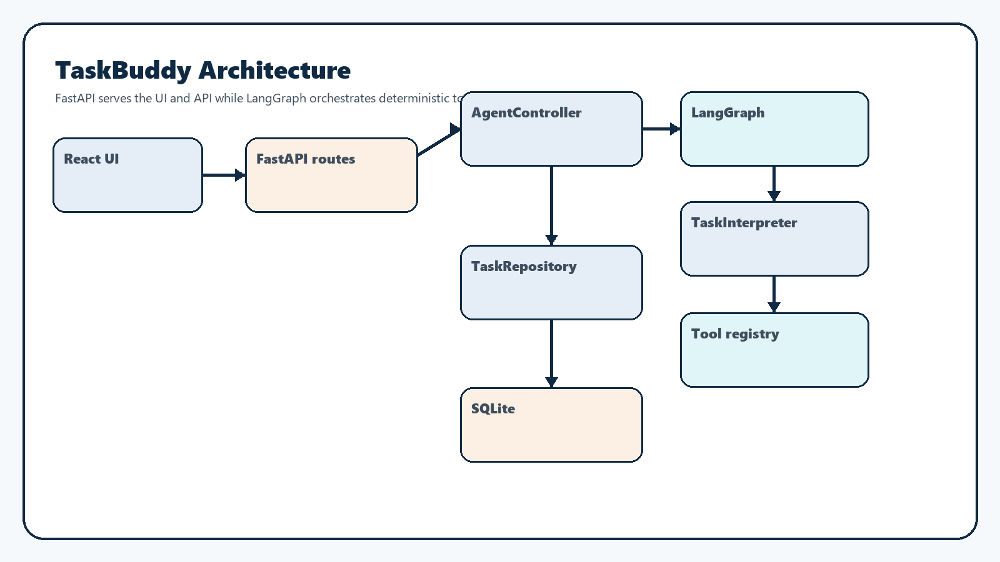
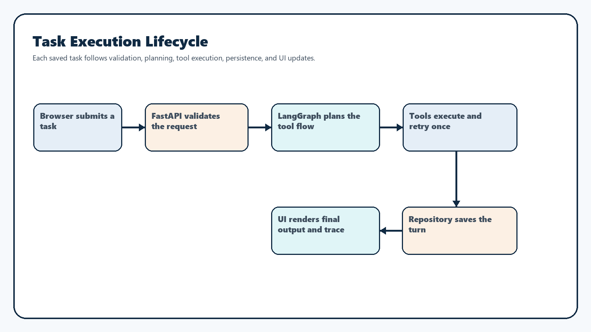
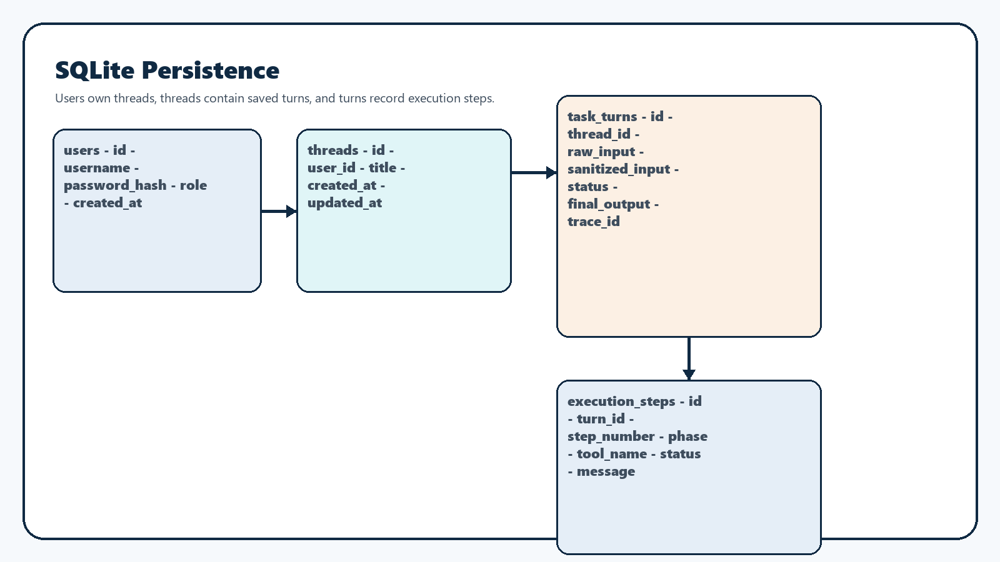
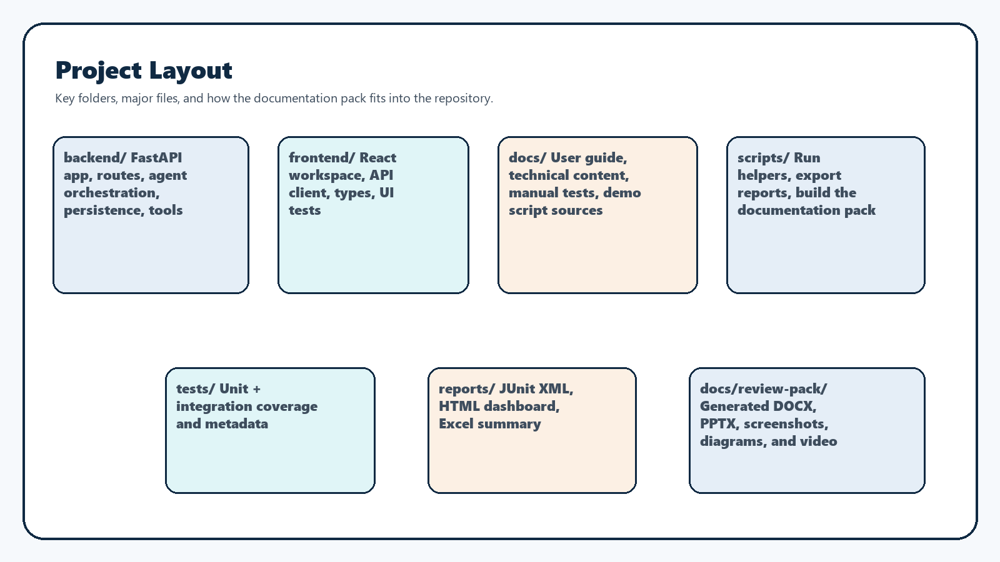

# TaskBuddy Technical Documentation

## Overview

TaskBuddy is a deterministic task workspace built around:

- FastAPI for HTTP APIs and static frontend delivery
- a React client served from `backend/static`
- LangGraph for staged orchestration
- SQLite for local persistence
- documented, deterministic tool routing
- a generated documentation pack with screenshots, DOCX files, a PPTX deck, and a demo video

The design favors explainability, reproducibility, and a low-friction local setup. The app intentionally avoids external live data sources for the current toolset.

## Runtime model

| Area | Decision | Purpose |
| --- | --- | --- |
| Web server | FastAPI | Single backend entrypoint for APIs and static UI delivery |
| Frontend delivery | Built React assets served from `backend/static` | No separate frontend runtime is required |
| Database | SQLite | Simple local persistence with no extra service |
| Orchestration | LangGraph around deterministic nodes | Explicit execution stages and traceability |
| Authentication | JWT cookie session | Lightweight local auth without token copy/paste |
| App runtime dependencies | `requirements.txt` in `.venv` | Keeps the normal runtime isolated |
| Documentation-pack dependencies | `requirements-review-pack.txt` in `.review-pack-venv` | Keeps DOCX, Playwright, and video tooling away from the app runtime |

## Architecture

### Ownership model

| Component | Responsibility |
| --- | --- |
| React UI | Sign-in flow, route changes, thread history, pending turn rendering, auto-scroll, and admin screen |
| FastAPI routes | Request validation, auth checks, thread CRUD, synchronous task execution, and SSE streaming |
| `AgentController` | Stable execution facade exposed to the API layer |
| LangGraph state graph | Validation, planning, tool execution, retry handling, and response assembly |
| `TaskInterpreter` | Deterministic prompt parsing, subtask splitting, and tool-step planning |
| Tool registry | Execution for the five supported tool families |
| `TaskRepository` | SQLite schema setup, seeding, persistence, limits, and lookups |

## Browser and API flow

### Browser routes

| Route | Purpose | Access |
| --- | --- | --- |
| `/` | Workspace home with no thread preselected | Authenticated |
| `/threads/:threadId` | Selected chat thread | Authenticated |
| `/admin` | User-management page | Admin only |

### API endpoint catalog

| Method | Path | Access | Purpose | Request summary | Response summary |
| --- | --- | --- | --- | --- | --- |
| `POST` | `/api/v1/auth/login` | Public | Validate credentials and create the session cookie | Username and password | `user_id`, `username`, `role` |
| `POST` | `/api/v1/auth/logout` | Public | Clear the session cookie | No body required | `{ "status": "ok" }` |
| `GET` | `/api/v1/auth/me` | Authenticated | Return the signed-in account summary | Cookie session | `user_id`, `username`, `role` |
| `GET` | `/api/v1/threads` | Authenticated | List thread summaries and optional search results | Optional `search` query | Array of thread summaries |
| `POST` | `/api/v1/threads` | Authenticated | Create a new empty chat thread | No body required | Thread detail payload |
| `GET` | `/api/v1/threads/{thread_id}` | Authenticated | Return one thread and its saved turns | Thread id path parameter | Thread detail payload |
| `DELETE` | `/api/v1/threads/{thread_id}` | Authenticated | Delete a thread owned by the current user | Thread id path parameter | `204 No Content` |
| `POST` | `/api/v1/threads/{thread_id}/tasks` | Authenticated | Run a task synchronously and persist the completed turn | `task_text` | Saved turn payload |
| `POST` | `/api/v1/threads/{thread_id}/tasks/stream` | Authenticated | Run a task through SSE and persist the completed turn | `task_text` | SSE `run_started`, `trace_step`, `retry_scheduled`, `completed`, `failed` |
| `GET` | `/api/v1/admin/users` | Admin only | List local users without passwords | Cookie session | Array of user summaries |
| `POST` | `/api/v1/admin/users` | Admin only | Create a local user | Username, password, role | User summary |
| `DELETE` | `/api/v1/admin/users/{user_id}` | Admin only | Delete a local user except the current admin session | User id path parameter | `204 No Content` |
| `GET` | `/health` | Public | Return basic health status | No body required | `{ "status": "ok" }` |

### Task-execution endpoints

| Endpoint | Purpose | When to use it |
| --- | --- | --- |
| `POST /api/v1/threads/{thread_id}/tasks` | Standard request/response task execution | Simple integrations, direct API testing, and non-streaming clients |
| `POST /api/v1/threads/{thread_id}/tasks/stream` | Streaming task execution with progressive trace events | Browser UX, live trace visibility, and SSE-oriented demos |

## LangGraph orchestration

| Node | Responsibility | Output |
| --- | --- | --- |
| `validation` | Normalize text, apply safety checks, and reject invalid requests early | Sanitized text and validation trace step |
| `planning` | Build the deterministic tool plan | One or two tool steps plus planning trace step |
| `execute_tool` | Run each tool in order, with retry metadata where applicable | Tool result data and execution trace step |
| `issue_response` | Build a handled failure or unsupported response | User-facing issue payload |
| `response_assembly` | Build final output, structured payload, tools-used list, and saved turn shape | Completed `TurnExecution` |

### State carried through the graph

- original task text
- sanitized task text
- parsed steps
- current tool index
- retry metadata
- prior summary context for chained text and result transforms
- collected result data
- ordered trace steps
- handled issue details
- final turn payload

## Tool catalog

| Tool | Purpose | Main routing cues | Dependencies | Known limits |
| --- | --- | --- | --- | --- |
| `TextProcessorTool` | Case transforms and counts | `convert`, `make`, `title case`, `count words`, `count characters` | Internal string parsing only | Occurrence counting inside larger text is unsupported |
| `CalculatorTool` | Safe arithmetic evaluation | `calculate`, `what is`, `add`, `minus`, `times`, `divide`, `quotient`, `product` | Internal parser only | Arithmetic only; no variables or functions |
| `WeatherMockTool` | Deterministic weather summaries | `weather`, `forecast`, `temperature`, `condition`, `humidity` with a supported city | Mock city data from config | Supported cities only |
| `CurrencyConverterTool` | Fixed-rate currency conversion | `convert`, `exchange`, `currency`, `rate`, explicit amount/currency pairs | Mock exchange-rate table | Only `USD`, `CAD`, `GBP`, and `AUD` are supported |
| `TransactionCategorizerTool` | Keyword-based category mapping | `categorize`, `classify`, `transaction`, `spend`, `merchant` | Keyword mapping table | Unmatched descriptions fall back to `other` |

### Routing rules worth noting

- quoted text is protected from false multi-subtask splitting
- `add 3+2` and `what is 8 minus 3` both route to the calculator
- `count the word "test"` is treated as a word-count request over the provided text
- `Categorize Starbucks transaction 45 CAD` stays on the categorizer
- `Categorize Starbucks transaction 45 CAD and convert to USD` creates a two-tool finance flow
- `Convert 67 CAD to INR` routes to the converter and returns a handled `CURRENCY_NOT_SUPPORTED` response

## Persistence design

### Persistence behavior

| Area | Behavior |
| --- | --- |
| User bootstrap | Fresh initialization seeds only `admin` / `admin123` |
| Thread titles | The first saved task becomes the thread title, trimmed to the configured limit |
| Turn history | Each saved turn includes task text, final output, output payload, tools used, trace steps, timestamp, and trace ID |
| Limits | The repository enforces max threads per user, max saved flows per thread, and role capacity |
| Sensitive handling | Sanitized text is stored when the safety layer changes the original input |

## Authentication and session model

| Decision | Why it was chosen |
| --- | --- |
| JWT cookie session | Works well for a single FastAPI-served UI without manual token handling |
| PBKDF2 + salt | Keeps local passwords hashed and non-recoverable |
| Admin-only user APIs | Protects user creation and deletion behind role checks |
| Session-only password reveal | Allows visibility for newly created users without persisting recoverable passwords |

## Validation and limits

| Limit | Value | Enforcement point |
| --- | ---: | --- |
| Request length | `250` characters | Safety guard and UI validation |
| Subtasks per request | `2` | Interpreter and composer validation |
| Threads per user | `5` | Repository and UI blocking |
| Saved task flows per thread | `3` | Repository and composer blocking |
| Admin accounts | `1` | Repository |
| Standard user accounts | `2` | Repository |

## Folder structure

| Path | Purpose |
| --- | --- |
| `backend/` | FastAPI app, orchestration, persistence, tools, and schemas |
| `frontend/` | React source, tests, and Vite config |
| `docs/` | User guide, technical content, manual test plan, demo script, and generated pack output |
| `scripts/` | Runtime helpers, report export, and documentation-pack generation |
| `tests/` | Backend unit and integration coverage plus metadata for export reports |
| `reports/` | Generated JUnit XML, Excel summaries, and HTML dashboards |

## Source-focused file inventory

### Backend Python files

| File | Purpose |
| --- | --- |
| `backend/app.py` | Creates the FastAPI app, registers exception handlers, mounts static assets, and exposes the health route |
| `backend/config.py` | Central constants, limits, demo data, and paths |
| `backend/errors.py` | App-specific error classes used for handled API and tool failures |
| `backend/models.py` | Dataclasses for parsed tasks, tool results, turns, threads, and users |
| `backend/security.py` | Password hashing, verification, and JWT helpers |
| `backend/api/routes.py` | REST and SSE endpoints plus auth dependencies |
| `backend/agent/controller.py` | API-facing execution facade around LangGraph orchestration |
| `backend/agent/interpreter.py` | Deterministic prompt parsing, subtask splitting, and tool planning |
| `backend/agent/state_graph.py` | LangGraph state definition and node wiring |
| `backend/persistence/repository.py` | SQLite schema setup, CRUD, seeding, and limit enforcement |
| `backend/safety/guard.py` | Input-length checks and sanitization helpers |
| `backend/schemas/api.py` | Pydantic request and response models |
| `backend/tools/base.py` | Shared tool contract |
| `backend/tools/text_processor.py` | Text tool implementation |
| `backend/tools/calculator.py` | Calculator implementation |
| `backend/tools/weather_mock.py` | Mock weather implementation |
| `backend/tools/currency_converter.py` | Currency conversion implementation |
| `backend/tools/transaction_categorizer.py` | Transaction categorization implementation |

### Frontend TypeScript files

| File | Purpose |
| --- | --- |
| `frontend/src/main.tsx` | React entrypoint |
| `frontend/src/App.tsx` | Main application shell, route handling, workspace flow, admin page, and composer behavior |
| `frontend/src/App.test.tsx` | Frontend interaction, routing, and regression tests |
| `frontend/src/api.ts` | Browser API helpers for auth, threads, tasks, and admin routes |
| `frontend/src/types.ts` | Shared frontend response and event types |
| `frontend/src/setupTests.ts` | Vitest and DOM test setup |
| `frontend/src/components/BrandMark.tsx` | Reusable TaskBuddy mark component |

### Scripts, docs, and tests

| File | Purpose |
| --- | --- |
| `app.py` | Root run entrypoint that delegates to `backend.app.run()` |
| `scripts/run-taskbuddy.ps1` | Windows one-command launcher for the app runtime |
| `scripts/run-taskbuddy.sh` | Linux, macOS, WSL, or Git Bash launcher for the app runtime |
| `scripts/build-review-pack.ps1` | Windows builder for the documentation pack with separate environments |
| `scripts/build-review-pack.sh` | POSIX shell builder for the documentation pack with separate environments |
| `scripts/generate_review_pack.py` | Screenshot capture, DOCX generation, PPTX generation, and video assembly |
| `scripts/export_test_results.py` | JUnit-to-Excel and HTML report export |
| `README.md` | Project overview and runtime instructions |
| `docs/user-guide.md` | Source content for the user guide DOCX |
| `docs/manual-test-plan.md` | Source content for the manual test plan DOCX |
| `docs/demo-script.md` | Source narration for the deck and demo video |
| `tests/integration/test_api.py` | Backend API integration coverage |
| `tests/unit/test_agent.py` | Interpreter, controller, and repository coverage |
| `tests/unit/test_tools.py` | Tool execution unit coverage |
| `tests/unit/test_safety.py` | Safety-guard coverage |
| `tests/unit/test_reports.py` | Report-export validation |

## Documentation-pack generation

| Area | Behavior |
| --- | --- |
| Runtime isolation | `.venv` uses `requirements.txt` only |
| Documentation isolation | `.review-pack-venv` uses `requirements-review-pack.txt` only |
| Screenshot capture | Playwright drives the running app and stores PNGs under `docs/review-pack/screenshots/` |
| DOCX generation | `python-docx` renders the markdown sources into branded documents |
| PPTX generation | `python-pptx` builds the widescreen demo deck and speaker notes |
| Narration | `pyttsx3` runs first, `gTTS` is the fallback, and silent video is the last fallback |
| Video output | `moviepy` assembles slide images and narration into `TaskBuddy-Demo.mp4` |

## Testing and reporting

| Area | Coverage |
| --- | --- |
| Backend unit tests | Interpreter routing, controller behavior, retry handling, repository limits, and tool behavior |
| Backend integration tests | Auth, thread CRUD, sync tasks, streaming tasks, and handled failures |
| Frontend tests | Login flow, route changes, thread limits, task-flow limits, auto-scroll, and admin interactions |
| Reports | Backend JUnit XML, frontend JUnit XML, Excel summary, HTML dashboard, and the generated documentation pack |

## Design tradeoffs

- FastAPI serves the built frontend to keep local runtime simple.
- Deterministic tool routing is favored over opaque model reasoning so behavior stays testable and explainable.
- Mock weather and currency data keep the challenge self-contained and reproducible.
- SQLite is sufficient for a local workflow and easy artifact sharing.
- The current React app still concentrates a large amount of UI logic in `App.tsx`; that is a maintainability tradeoff, not a functional blocker.
- The documentation pack uses a separate environment because presentation tooling should never interfere with the app runtime.
