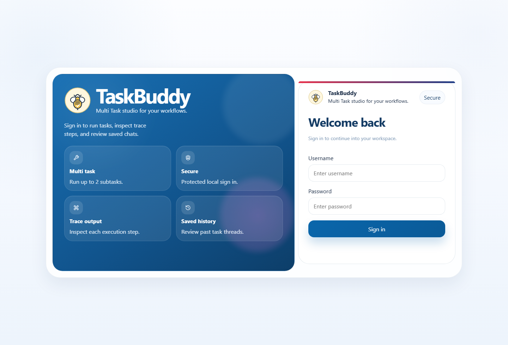
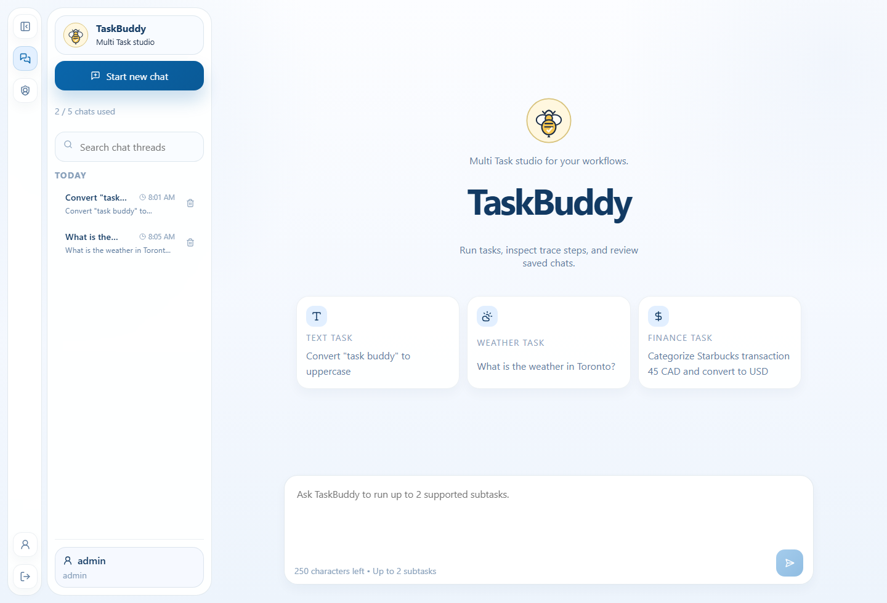
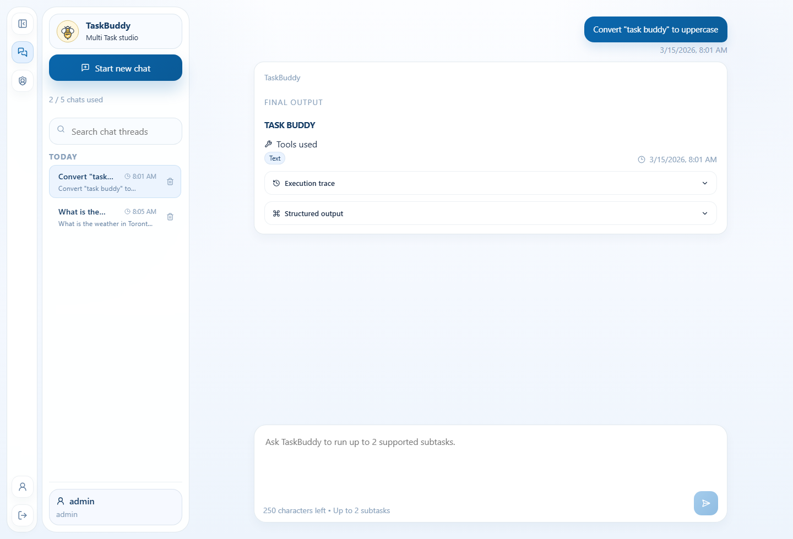
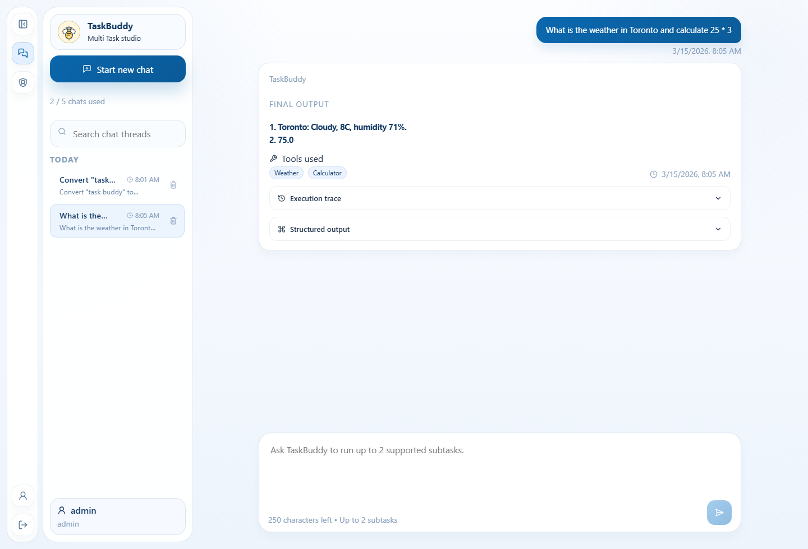
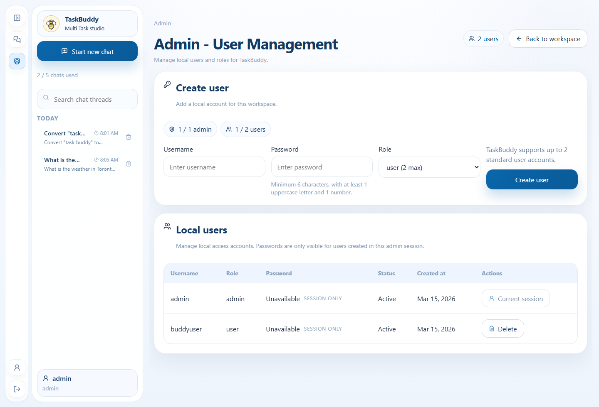

# TaskBuddy User Guide

## Purpose

This guide explains how to access TaskBuddy, sign in, create and manage chats, understand response cards, and use the admin page.

## What TaskBuddy does

TaskBuddy is a chat-style workspace for deterministic tool execution. A signed-in user can submit a supported prompt, see which tool ran, inspect the final output, and review the saved execution trace later.

## Roles

| Role | Access |
| --- | --- |
| `admin` | Can sign in, create threads, run tasks, inspect saved history, open the admin page, and create or delete local users. |
| `user` | Can sign in, create threads, run tasks, and inspect saved task history. |

## How to access the app

### Local: one command

Windows PowerShell:

```powershell
powershell -ExecutionPolicy Bypass -File .\scripts\run-taskbuddy.ps1
```

Linux, macOS, WSL, or Git Bash:

```bash
./scripts/run-taskbuddy.sh
```

Open `http://localhost:8000`.

### Docker Compose

```powershell
docker compose up --build
```

Open `http://localhost:8000`.

## Default sign-in

| Username | Password | Role |
| --- | --- | --- |
| `admin` | `admin123` | `admin` |



## Workspace overview

After sign-in, TaskBuddy opens the main workspace. The workspace includes:

- a thread history sidebar
- a workspace home state or selected chat thread
- a composer for supported tasks
- response cards that show final output, tools used, structured output, and trace steps



## Creating and managing chats

1. Select `Start new chat`.
2. Enter a supported prompt in the composer.
3. Submit with `Run task`.
4. Review the completed result inside the active thread.
5. Reopen or delete older chats from the sidebar when needed.

### Chat and flow limits

- each user can keep up to `5` chat threads
- each chat can keep up to `3` saved task flows
- each request can include up to `2` subtasks

## Running supported tasks

TaskBuddy supports five tool families.

| Tool | What it does | Example prompt |
| --- | --- | --- |
| `TextProcessorTool` | Converts case or counts words and characters. | `Convert "task buddy" to uppercase` |
| `CalculatorTool` | Solves arithmetic expressions without `eval`. | `Add 3+2` |
| `WeatherMockTool` | Returns deterministic weather data for supported cities. | `Forecast for London` |
| `CurrencyConverterTool` | Converts supported currencies using fixed mock rates. | `Exchange 15 USD to CAD` |
| `TransactionCategorizerTool` | Categorizes merchant and spend descriptions. | `Categorize Starbucks transaction 45 CAD` |

## Reading the response card

Each completed turn shows the information in this order:

1. final output
2. tools used
3. structured output data
4. execution trace
5. timestamp and trace ID



### Multi-tool responses

If a request triggers two supported tools, TaskBuddy returns both results in numbered order and records both steps in the trace.



## Admin page

The admin page is available only to the `admin` role.

From the admin page you can:

- create local users
- delete local users
- review usernames, roles, and created timestamps
- reveal the password only for users created during the current admin session

Rules:

- only `1` admin account is allowed
- only `2` standard users are allowed
- passwords remain hashed in the database



## Validation and troubleshooting

TaskBuddy shows inline validation when the browser can detect the issue before sending the request.


| Symptom | Likely cause | What to do |
| --- | --- | --- |
| Login fails | Wrong username or password | Use `admin` / `admin123` on a fresh database or create a user from the admin page. |
| A request is rejected as too complex | The prompt has more than `2` subtasks | Split the work into multiple requests. |
| A chat cannot accept a new task | The thread already has `3` saved task flows | Create a new chat or delete an older one. |
| Currency conversion fails | Unsupported target currency such as `INR` | Use `USD`, `CAD`, `GBP`, or `AUD`. |
| Weather prompt fails | Unsupported city | Use Toronto, Vancouver, New York, Chicago, London, or Sydney. |
| The password eye icon is unavailable for a row | The user was not created in the current admin session | Passwords are intentionally not recoverable from storage. |

## Quick verification checklist

- Sign in with the admin account.
- Create one text-processing chat and one multi-tool chat.
- Confirm that the response card shows final output first and trace details afterward.
- Open the admin page and review user-management controls.
- Confirm that thread and task-flow limits are enforced with clear messages.
